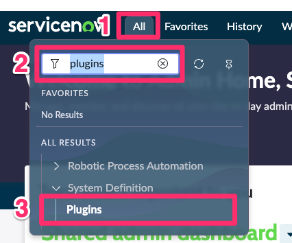
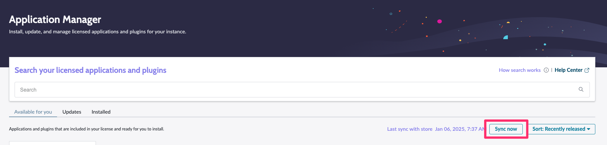
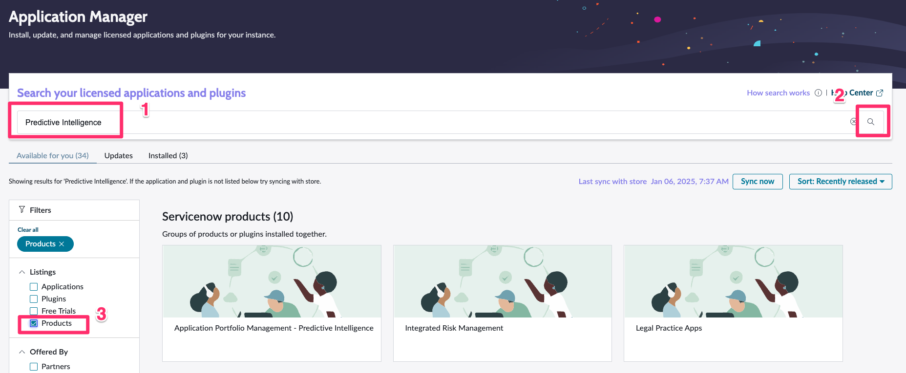
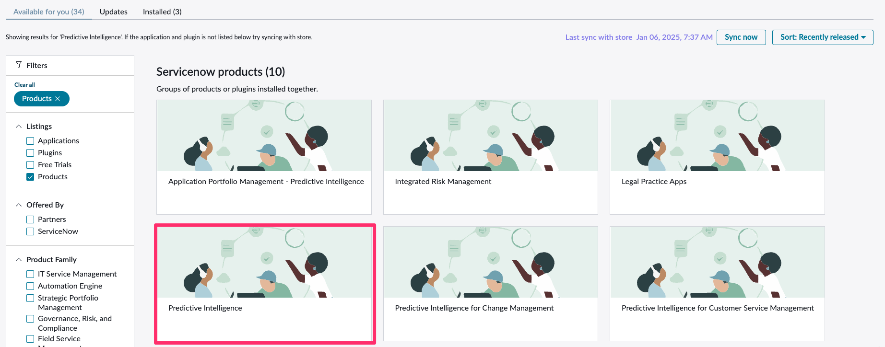
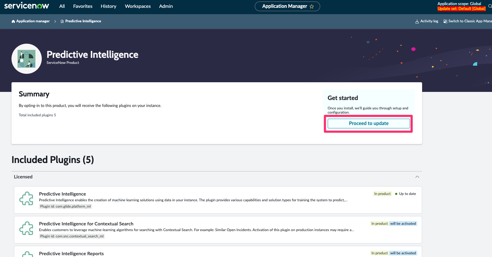
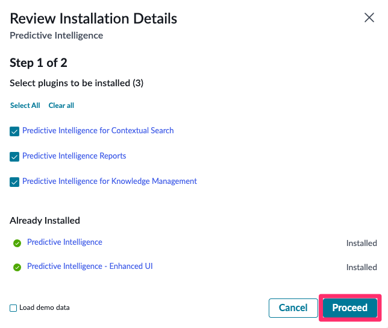
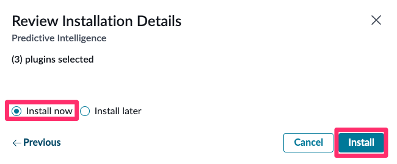

## Introdução
Este guia descreve como configurar a funcionalidade de **Clustering de Inteligência Preditiva** para identificar candidatos de automação utilizando dados do cliente.

## Objetivo
- Identificar casos de uso de automação utilizando dados do cliente.
- Demonstrar o potencial de ferramentas como **Integration Hub, RPA Hub, Document Intelligence e Stream Connect** 

## Entendendo o Processo

## Etapas do Processo

  1. Ativar plugins: **Predictive Intelligence, Continual Improvement e Performance Analytics.**
  2. Configurar as Definições de Soluções de Clustering e analisar os Clusters resultantes para identificar candidatos de automação.
  3. Identificar e validar candidatos de automação.
  4. Fornecer recomendações.
  5. Quantificar e apresentar o valor para o negócio.

## Requisitos

- Acesso de administrador a uma instância sub-prod recentemente clonada, executando a versão New York ou superior.
- Ativação dos plugins Predictive Intelligence e Continual Improvement Management.

# Ativar os plugins

## Predictive Intelligence

1. Acesse a instância de sub-prod clonada com perfil de Administrador
2. Navegue até os Plugins (All > System Definition > Plugins)
   
3. Primeiro, iremos sincronizar os plugins disponíveis, cliquem em `Sync now`
   
4. Aguarde a sincronização finalizar.
5. Pesquiser por (1) **"Predictive Intelligence"** na barra de pesquisa, (2) **busque** e filtre apenas por (3) **Products**.
   
6. Clique no produto **Predictive Intelligence**
   

   :::info
   Caso o produto com nome **APENAS** de **Predictive Intelligence** não apareça, clique em view more
   :::

7. Clique no botão `Install` ou `Proceed to update`

8. Clique em Proceed

9. Selecione Install now e Instrall

10. Aguarde o processo de instalação finalizar.

## Continual Improvement Management

1. Pesquiser por (1) **"Continual Improvement Management"** na barra de pesquisa, (2) **busque** e filtre apenas por (3) **Products**.

2. Clique no produto **Continual Improvement Management**

3. Clique no botão `Install` ou `Proceed to update`

4. Clique em Proceed

5. Selecione Install now e Instrall

6.  Aguarde o processo de instalação finalizar.

