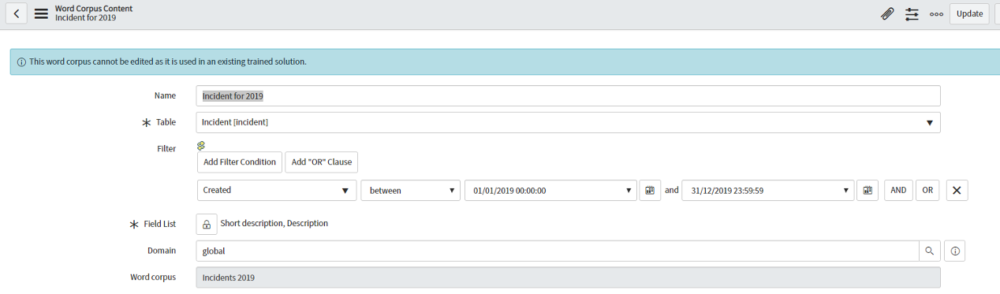
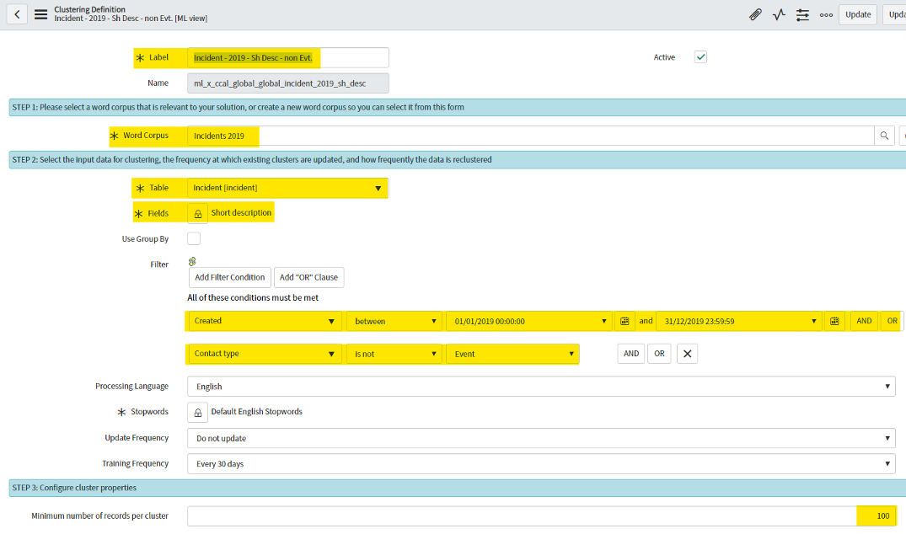

## Clustering de Inteligência Preditiva

**Inteligência Preditiva** é uma função da plataforma ServiceNow que habilita classificação, similaridade e capacidades de previsão de clustering em aplicativos ServiceNow. Clustering utiliza um corpus de palavras para agrupar registros similares para análise de dados.

A aba de Visualização de Cluster no formulário de Definição de Solução de Clustering fornece um gráfico de dispersão que mostra os 50 principais clusters e seus registros individuais. É possível visualizar o rótulo, tamanho e valor percentil de qualidade de cada cluster.

## Passo 1 - Criar o Corpus de Palavras

:::info
A partir da versão **Xanadu**, este passo **não é mais necessário.**

Os modelos nos frameworks de classificação, clustering e similaridade agora utilizam soluções Workflow, que já vêm pré-treinadas. Por isso, não é mais necessário utilizar um corpus de palavras para suas novas soluções.
:::

Na instância sub-prod, identifique os campos significativos para a análise de clustering nos registros do cliente. Por exemplo:

- Apenas "Short Description".
- "Short Description" e "Description".

Defina também o período de análise; por exemplo, todos os incidentes criados em 2019. Em seguida, crie o Corpus de Palavras que coletará as palavras e frases úteis para sua análise.

**Procedimento:**

1. Navegue até **Predictive Intelligence > Word Corpus**.
2. No formulário de Word Corpus, clique em **New**.
3. Configure o campo **Name** com um título único que faça referência ao conteúdo do corpus. Exemplo: "Incidents for 2019".
4. Clique em **Submit**.
5. Na lista de Word Corpus, localize o corpus criado e clique no nome para abrir o registro.
6. Na seção **Word Corpus Contents**, clique em **New**.
7. No formulário **Word Corpus Content**, configure os seguintes campos:
   - **Name**: Insira um título que identifique os dados a serem adicionados (ex.: "Incidents for 2019").
   - **Table**: Selecione a tabela que contém os dados a serem incluídos no corpus. Para este caso de uso, escolha "Incident [incident]".
   - **Filter**: Especifique os valores de condição do filtro (ex.: "Created between 01/01/2019 and 31/12/2019").
   - **Field List**: Selecione os campos a serem usados, como "Short Description" e, opcionalmente, "Description".

**Nota:** O número de registros por tabela para criação do Word Corpus em soluções de Similaridade e Clustering é limitado a 300.000. Caso encontre um limite de 100.000 registros, é possível aumentar este limite acessando a instância em modo de manutenção (**Predictive Intelligence > Configuration**).

8. Clique em **Submit**.

Repita este passo para todas as outras tabelas que serão utilizadas. Na maioria dos casos, incluirá **Requested Items**, **Calls**, **Interactions** e **HR Cases**.

## Passo 2 - Iniciar o Treinamento de Soluções de Clustering

Você pode treinar diferentes soluções utilizando filtros variados. No exemplo a seguir, criaremos uma definição de clustering para incidentes que não são de origem **Event Source**.

**Procedimento:**

1. Navegue até **Predictive Intelligence > Clustering > Solution Definitions**.
2. Na lista de Clustering Definitions, clique em **New**.
3. No formulário de Clustering Definition, configure os seguintes campos:
   - **Label**: Insira um nome único para a solução de clustering (ex.: "Incident - 2019 - Short Desc - non Event").
   - **Name**: Este campo será preenchido automaticamente com um nome baseado no valor de Label.
   - ***Word Corpus**: Selecione um corpus existente relevante para a solução (ex.: "Incidents 2019").
   :::info
   A partir da versão **Xanadu**, o campo `Word Corpus` **não é mais necessário.**
   :::
   - **Table**: Escolha a tabela que contém os tipos de registro a serem agrupados (ex.: "Incident [incident]").
   - **Fields**: Selecione os campos que ajudarão a identificar os registros nos clusters (ex.: "Short Description").
   - **Use Group By**: Selecione esta opção se desejar agrupar registros de entrada por um campo antes de criar os clusters. Para este caso, deixe desmarcado.
   - **Filter**: Adicione condições de filtro aos registros de entrada (ex.: "Created between 01/01/2019 and 31/12/2019" e "Contact type is not Event").
   - **Processing Language**: Selecione o idioma predominante dos dados (ex.: "English" ou "Italian").
   - **Stopwords**: O sistema adiciona automaticamente uma lista de stopwords com base no idioma selecionado. É possível criar e selecionar listas personalizadas se necessário.
   - **Update Frequency**: Escolha a frequência com que o sistema deve descartar os resultados anteriores e recriar os clusters. Para este caso, selecione **Do not update**.
   - **Training Frequency**: Determine a frequência de treinamento (ex.: "Every 30 days" ou "Train just once").
   - **Minimum number of records per cluster**: Insira o número mínimo de registros permitido por cluster (ex.: 100).

   **Nota:** Utilize o mesmo período e campos especificados no corpus de palavras selecionado. Por exemplo, se o corpus foi criado com "Short Description" de incidentes dos últimos 12 meses, crie a definição de clustering com os mesmos critérios.

   

   **Nota:** Por padrão, o número de registros para clustering é limitado a 100.000. Esse limite pode ser aumentado acessando a instância em modo de manutenção (**Predictive Intelligence > Configuration**).

1. Clique em **Submit & Train** (ou **Update & Train** no caso de atualizar uma definição existente).
2. Ao enviar a solução para treinamento, clique em **OK** na janela de ativação de treinamento para confirmar.

Repita as etapas acima para todos os registros significativos (Requested Items, HR Cases, Interactions, etc.).

**Exemplos de Tabelas e Resultados Típicos:**

| Tabela e Descrição                         | Resultados Candidatos Típicos                          |
|-------------------------------------------|-------------------------------------------------------|
| Incident [incident] - 2019 - Desc - non Event  | VA Conversations e Integration Hub                    |
| Requested Items [sc_req_item] - 2019 - Description | VA Conversation, Integration Hub, APIs e Spokes     |
| HR Cases [sn_hr_core_case] - 2019 - Short Desc  | PDF Generator, VA Conversation, Integration Hub, APIs |
| Interactions - 2019 - Short Description    | VA Conversation, Integration Hub, APIs e Spokes       |

Continue adicionando tabelas e filtros conforme necessário para resultados específicos ao cliente.

**Nota:** É possível treinar até 2 soluções por vez, e elas podem levar até 4 horas para serem concluídas.

---
