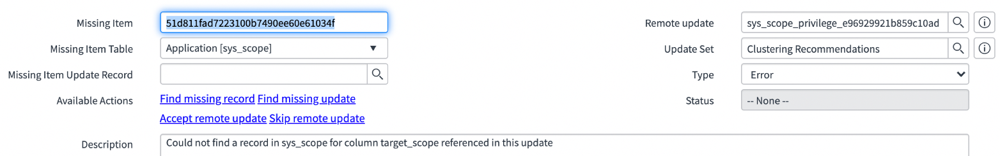
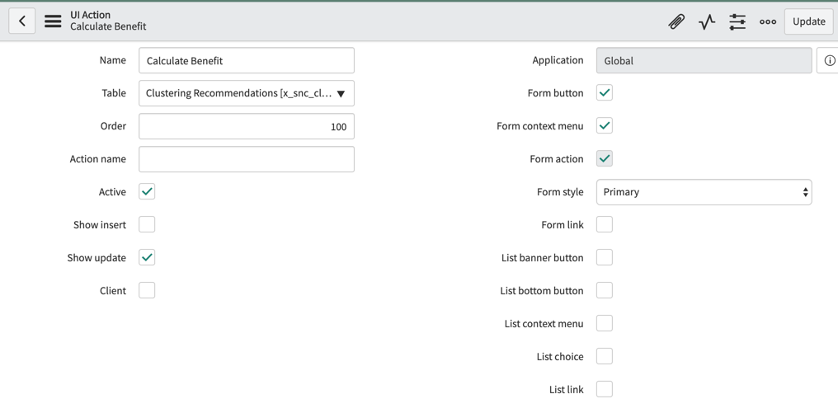
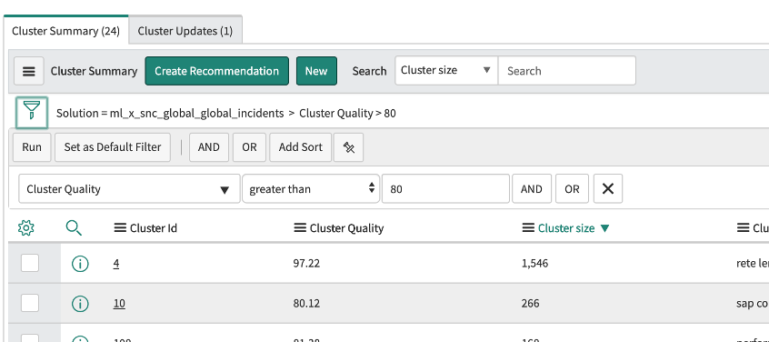
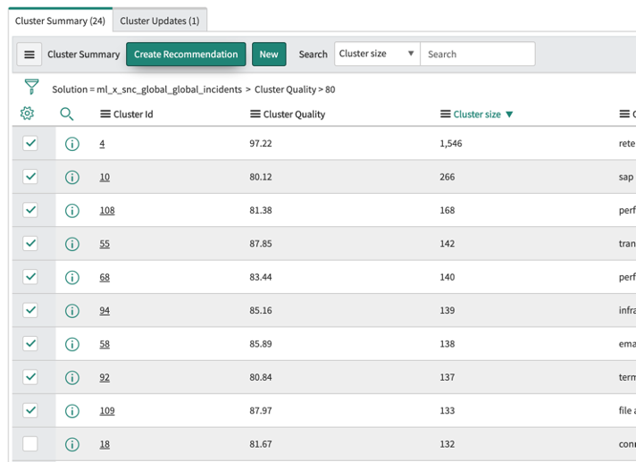
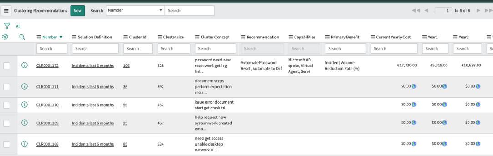
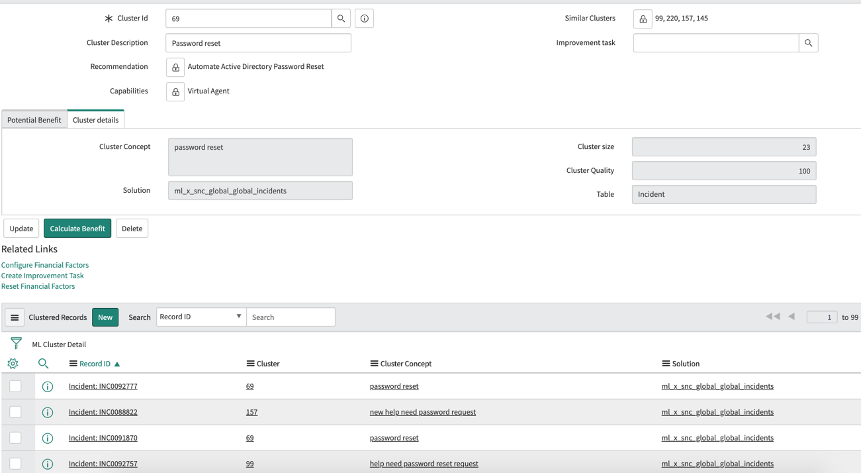

## Download do Clustering Recommendations Utility

Para obter o utilitário:

- Arquivo da aplicação: [Clustering Recommendations Utility](https://developer.servicenow.com/connect.do#!/share/contents/7317467_clustering_recommendations_utility?t=PRODUCT_DETAILS).

---

## Instalação do Clustering Recommendations Utility

**Procedimento:**

1. Navegue até **System Update Sets > Retrieved Update Sets**.
2. Clique em **Import Update Set from XML** (no final da página).
3. Selecione o arquivo da aplicação (Clustering Recommendations Utility.xml).
4. Abra o arquivo carregado.
5. Execute **Preview Update Set** (o processo pode levar alguns minutos).
   - **Nota:** Caso o Customer Service Management não esteja ativo, você pode ignorar o erro exibido (**Accept remote update**).


6. Após a pré-visualização, execute o **Commit Update Set**.

---

## Criação da UI Action "Calculate Benefit"



Para configurar a ação:

### Detalhes da UI Action

- **Nome:** Calculate Benefit
- **Aplicação:** Global
- **Tabela:** Clustering Recommendations
- **Form Button:** true
- **Show insert:** false
- **Show update:** true
- **Condição:**
  ```javascript
  current.condition != "" && current.solution_type != "em_alert"
  ```

### Script da UI Action
```javascript
var cost_rec = 0;
if (current.solution_type == "sc_req_item")
	cost_rec = current.cost_per_request;
if (current.solution_type == "incident")
	cost_rec = current.cost_per_incident;
if (current.solution_type == "sn_si_incident")
	cost_rec = current.cost_per_incident;
if (current.solution_type == "sn_customerservice_case")
	cost_rec = current.cost_per_case;
if (current.solution_type == "new_call")
	cost_rec = current.cost_per_call;
if (current.solution_type == "interaction")
	cost_rec = current.cost_per_interaction;
if (current.solution_type.startsWith('sn_hr_core'))
	cost_rec = current.cost_per_hr_case;
if (current.primary_benefit == "Reduce manual effort" && current.percentage_work_time == "")
	gs.addErrorMessage("Time worked % can't be null");

var gr = new GlideRecord(current.solution_type);
	gr.addEncodedQuery(current.condition);
	gr.addQuery('active',false);
	gr.query();

var rowCount = 0;
var totalDur = 0;
var avgDur = 0;
var avg = 0;
var current_cost = 0;
var current_cost_business_requester = 0;
var startTime = "";
var endTime = "";
var avgReassign = 0;

while (gr.next() ) {
	rowCount = rowCount +1;
	avgReassign = avgReassign + gr.reassignment_count;
	startTime = gr.opened_at.getDisplayValue();
	if (current.end_time_field == "resolved_at")
		endTime = gr.resolved_at.getDisplayValue();
	if (current.end_time_field == "closed_at")
		endTime = gr.closed_at.getDisplayValue();
	if ( startTime != "" && endTime != ""){
		dur = parseInt(gs.dateDiff(startTime, endTime, true));
		totalDur = totalDur + dur;
	}
}
// Calculate Average Duration Time
avgDur = Math.round(totalDur / rowCount);

var avgDurHour = Math.floor(avgDur / 3600);
current.total_records = rowCount;
current.average_duration_time_hours = avgDurHour;

if (avgReassign > 0)
	current.avg_reassignment_count = rowCount / avgReassign;
if (avgReassign == 0)
	current.avg_reassignment_count = 0;

if (current.primary_benefit == "Reduce manual effort"){
	current.effort_to_fulfill_the_requests_hours = (current.average_duration_time_hours / 100) * current.percentage_for_work_time;
	// Calculate Cost Reduction for Fulfillers
	current.current_cost = current.hourly_rate * current.effort_to_fulfill_the_requests_hours * rowCount;
	current.year1 = (current.current_cost / 100) * current.scaler_year1;
	current.year2 = (current.current_cost / 100) * current.scaler_year2;
	current.year3 = (current.current_cost / 100) * current.scaler_year3;
	current.total_cost_reduction = parseFloat(current.year1) + parseFloat(current.year2) + parseFloat(current.year3);

	// Calculate Productivity Improvement for End Users
	current.productivity_impact = (current.average_duration_time_hours / 100) * current.time_reclaimed_to_end_user;
	current.current_cost_business_requester = current.productivity_impact * current.hourly_salary_per_employee_requester * rowCount;
	current.productivity_improvement_year1 = (current.current_cost_business_requester / 100) * current.improvement_year1;
	current.productivity_improvement_year2 = (current.current_cost_business_requester / 100) * current.improvement_year2;
	current.productivity_improvement_year3 = (current.current_cost_business_requester / 100) * current.improvement_year3;
	current.total_productivity_improvement = parseFloat(current.productivity_improvement_year1) + parseFloat(current.productivity_improvement_year2) + parseFloat(current.productivity_improvement_year3);
}

if (current.primary_benefit == "Incident Volume Deflection" || current.primary_benefit == 'Request Volume Deflection' || current.primary_benefit == 'Case Volume Deflection'){
	current.current_cost = rowCount * cost_rec;
	current.current_cost_business_requester = rowCount * current.cost_per_business_requester;
	current.year1 = (current.current_cost / 100) * current.scaler_year1;
	current.year2 = (current.current_cost / 100) * current.scaler_year2;
	current.year3 = (current.current_cost / 100) * current.scaler_year3;
	current.total_cost_reduction = parseFloat(current.year1) + parseFloat(current.year2) + parseFloat(current.year3);
	current.productivity_impact = (current.average_duration_time_hours / 100) * current.time_reclaimed_to_end_user;
	current.current_cost_business_requester = current.productivity_impact * current.hourly_salary_per_employee_requester * rowCount;
	current.productivity_improvement_year1 = (current.current_cost_business_requester / 100) * current.improvement_year1;
	current.productivity_improvement_year2 = (current.current_cost_business_requester / 100) * current.improvement_year2;
	current.productivity_improvement_year3 = (current.current_cost_business_requester / 100) * current.improvement_year3;
	current.total_productivity_improvement = parseFloat(current.productivity_improvement_year1) + parseFloat(current.productivity_improvement_year2) + parseFloat(current.productivity_improvement_year3);
}

current.potential_total_benefit = parseFloat(current.total_cost_reduction) + parseFloat(current.total_productivity_improvement);
current.update();
action.setRedirectURL(current);
```

---

## Seleção de Clusters para Análise

1. Navegue até **Predictive Intelligence > Clustering > Solutions**.
2. Abra a solução desejada (ex.: `ml_x_snc_global_global_incidents`).
3. Na aba **Cluster Summary**, filtre a lista por **Cluster Quality** (ex.: `Cluster Quality > 80%`).

4. Ordene por **Cluster Size** (ordem decrescente).
5. Selecione os Clusters que deseja analisar e clique em **Create Recommendation**.

6. Os registros selecionados serão copiados para a tabela **Clustering Recommendations**.
7. Navegue até **Clustering Recommendations > My Recommendations**.

---

## Análise dos Clusters Selecionados

1. Abra os registros da recomendação de cluster.
2. Analise os registros agrupados no Cluster.
3. Use o campo **Cluster Description** para descrever o cluster (ex.: "Password Reset").
4. Utilize o campo **Similar Clusters** para associar o registro de recomendação a qualquer cluster com um conceito semelhante.
5. Consulte os registros relacionados na lista **Clustered Records** para visualizar os registros associados ao Cluster e aos Clusters Similares.
