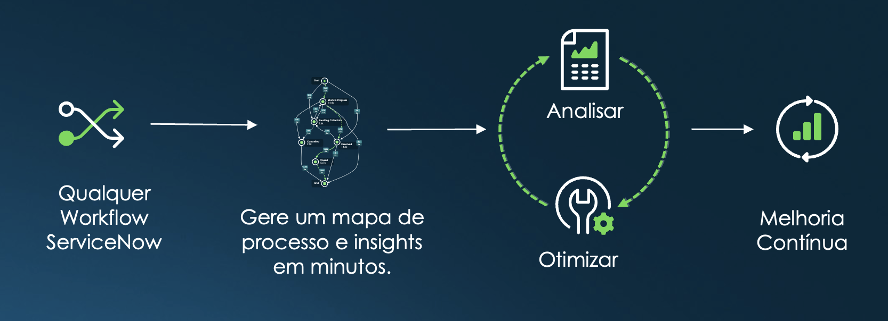

## Introdução
Este guia descreve como configurar a funcionalidade de **Process Mining** para avaliar tarefas e identificar oportunidades de automação e melhoria no processo.

## Objetivo
- Avaliar processos utilizando **Process Mining**.
- Identificar ineficiências e oportunidades de automação com **Automation Discovery**.
- Demonstrar como identificar gargalos e oportunidades de otimização no processo.
- Fornecer insights baseados em dados para otimizar o fluxo de trabalho.

## Entendendo o Processo

Automatiza o processo de identificação de ineficiências, permitindo que as empresas otimizem suas operações e alcancem níveis mais altos de eficiência.

### Responsáveis

- Responsáveis pelo Processo/Analistas
- Equipes de Excelência/Aprendizado e Melhoria de Processo
- Líderes de Operações

## Etapas do Processo

1. Ativar os plugins: **Process Mining (sn_po)** e **Automation Discovery (sn_auto_discovery)** (caso sua instância seja anterior à versão Xanadu ou Yokohama, respectivamente).
2. Configurar o projeto de avaliação para a tabela de incidentes.
3. Analisar os dados processados e identificar padrões.
4. Avaliar as oportunidades de melhoria e automação fornecidas pelo sistema.
5. Quantificar e apresentar os ganhos potenciais para o negócio.

## Requisitos

- Acesso de administrador a uma instância sub-prod recentemente clonada.
- Versão do ServiceNow: **Xanadu** ou superior para Process Mining, **Yokohama** ou superior para Automation Discovery.
- Plugin **Process Mining (sn_po)** ativado (ativado por padrão a partir da versão Xanadu, sem necessidade de instalação manual).
- Plugin **Automation Discovery (sn_auto_discovery)** disponível na ServiceNow Store e instalado manualmente.

