## **1. Identifique padrões e gargalos no processo**
O **Process Mining** permite visualizar o fluxo real de trabalho e compará-lo ao fluxo esperado. Essa análise ajuda a entender onde ocorrem gargalos e desvios, facilitando a otimização dos processos.

### **1.1 Dashboards e fluxos de trabalho**
- Utilize os **dashboards interativos** para visualizar o fluxo completo das operações.
- Identifique padrões comuns e fluxos que fogem do caminho ideal.
- Meça o impacto de diferentes pontos problemáticos no processo.

### **1.2 Análise de variação e gargalos**
- Identifique processos com **alta variação** e onde ocorrem **gargalos frequentes**.
- Avalie a conformidade do processo para garantir que as etapas sejam seguidas corretamente.

## **2. Análise de ineficiências comuns**
A análise de ineficiências permite identificar pontos que impactam negativamente a performance dos processos. 

### **2.1 Ping-pong (Trocas excessivas de responsabilidade)**
- Verifique incidentes ou tarefas que circulam repetidamente entre diferentes grupos ou indivíduos.
- Analise se há falta de clareza na atribuição inicial ou se um grupo não tem a autonomia necessária para resolver o problema.

### **2.2 Rework (Retrabalho no fluxo de resolução)**
- Identifique chamados ou processos que necessitam de revisões frequentes.
- Descubra oportunidades para melhoria de **documentação**, **treinamento** ou **automação**.

### **2.3 Desvios do fluxo esperado**
- Identifique processos que não seguem a rota padronizada.
- Avalie se esses desvios são necessários ou indicam falhas no desenho do processo.

### **2.4 SLA Breach Analysis (Análise de violações de SLA)**
- Identifique tickets que ultrapassaram os SLAs e analise as principais causas.
- Descubra quais etapas do fluxo contribuem para atrasos.

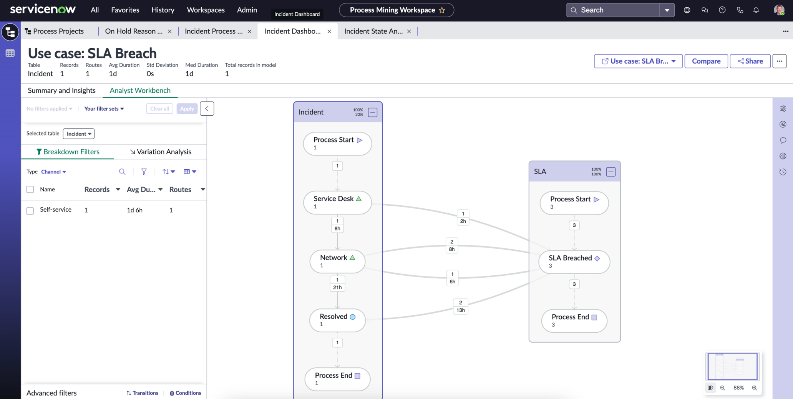

### **2.5 Approval Bottlenecks (Gargalos em aprovações)**
- Identifique etapas de aprovação que retardam a execução do processo.
- Descubra se há aprovações manuais que poderiam ser automatizadas.

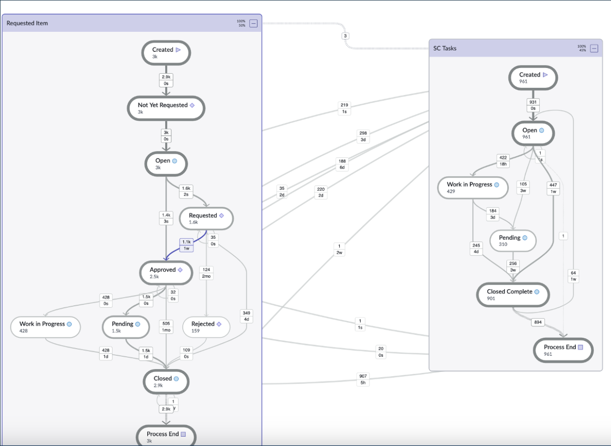

### **2.6 Multi-hop Analysis (Múltiplas transferências)**
- Descubra onde ocorrem transferências desnecessárias de chamados entre equipes.
- Avalie como reduzir a necessidade de encaminhamentos.

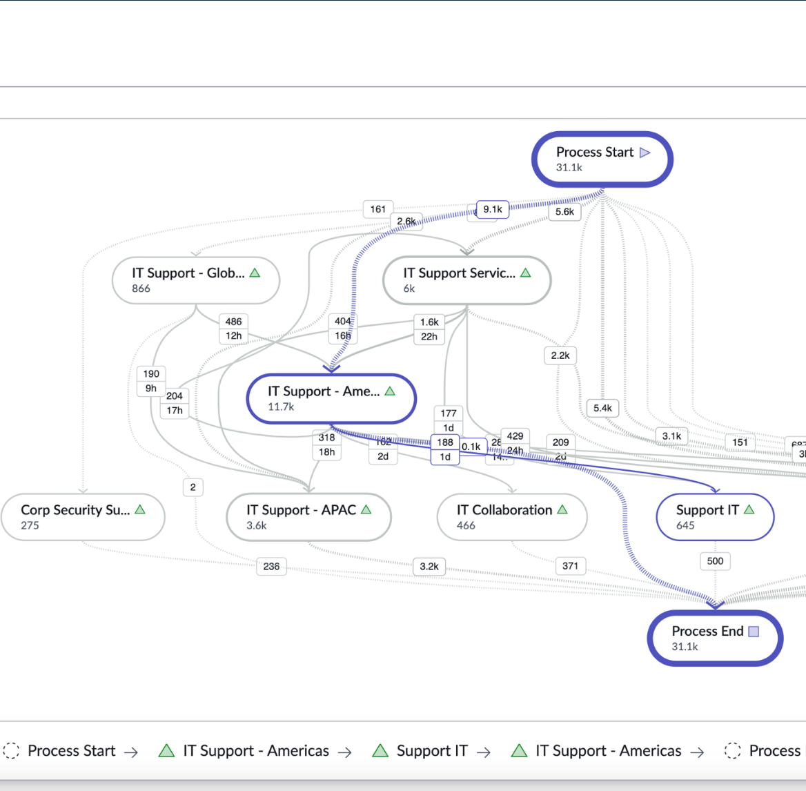

### **2.7 On Hold (Reason) Analysis (Análise do tempo em espera)**
- Identifique processos que passam muito tempo em estado "On Hold".
- Avalie o impacto desse atraso na eficiência geral do fluxo.

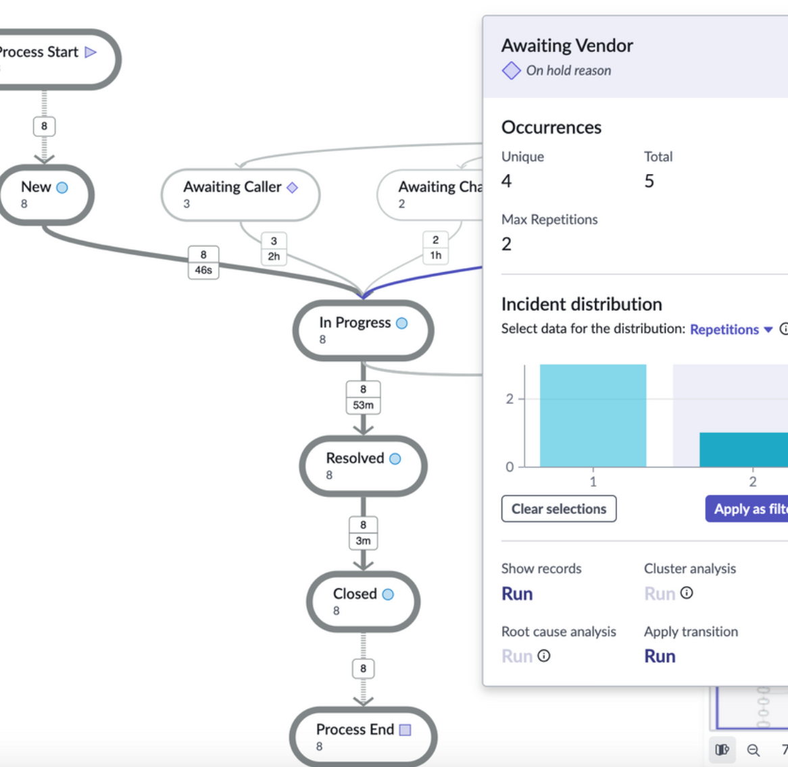

### **2.8 Longer to route than resolve (Tempo de roteamento maior que o tempo de resolução)**
- Identifique chamadas que demoram mais para serem encaminhadas do que para serem resolvidas.
- Encontre oportunidades para melhorar o direcionamento inicial dos chamados.

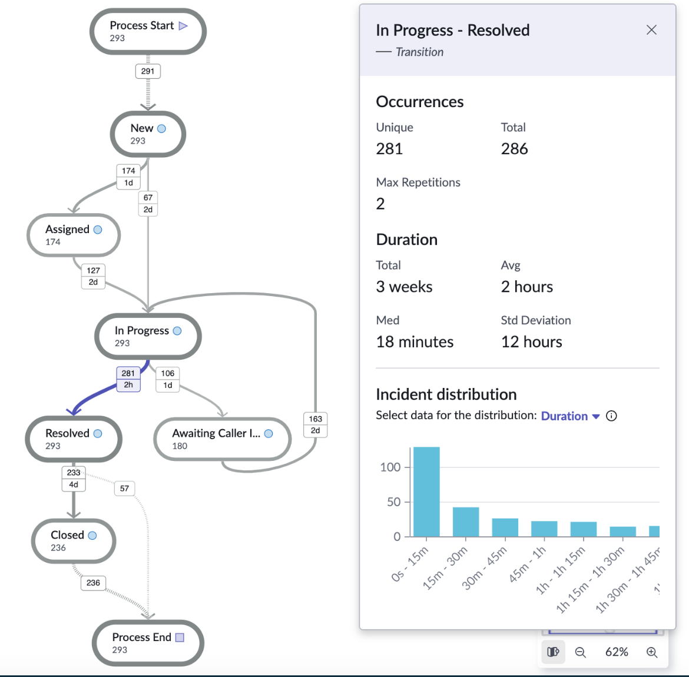

### **2.9 Reopened Work Analysis (Análise de retrabalho por reabertura)**
- Identifique quais incidentes ou tarefas estão sendo reabertos.
- Descubra se isso ocorre por erro na resolução ou falta de informação.

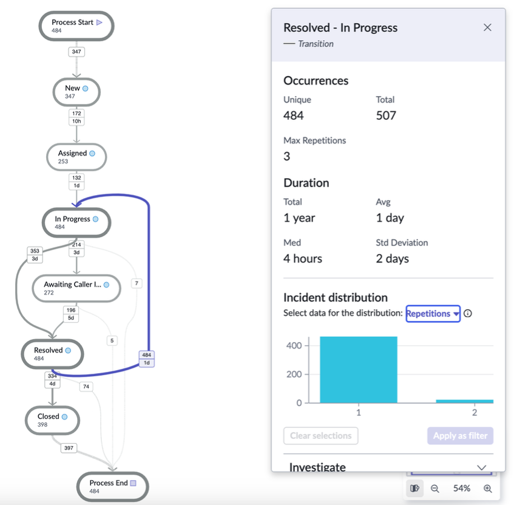

### **2.10 Channel Analysis (Análise de canais de entrada)**
- Avalie o desempenho dos canais de entrada, como telefone, e-mail, chat ou portal.
- Descubra se há problemas na coleta inicial de informações que impactam a resolução.

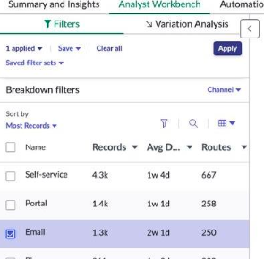

### **2.11 Reprioritization Analysis (Análise de re-priorização de tarefas)**
- Verifique se mudanças frequentes de prioridade estão impactando a eficiência.
- Descubra padrões de re-priorização que indicam problemas na triagem inicial.

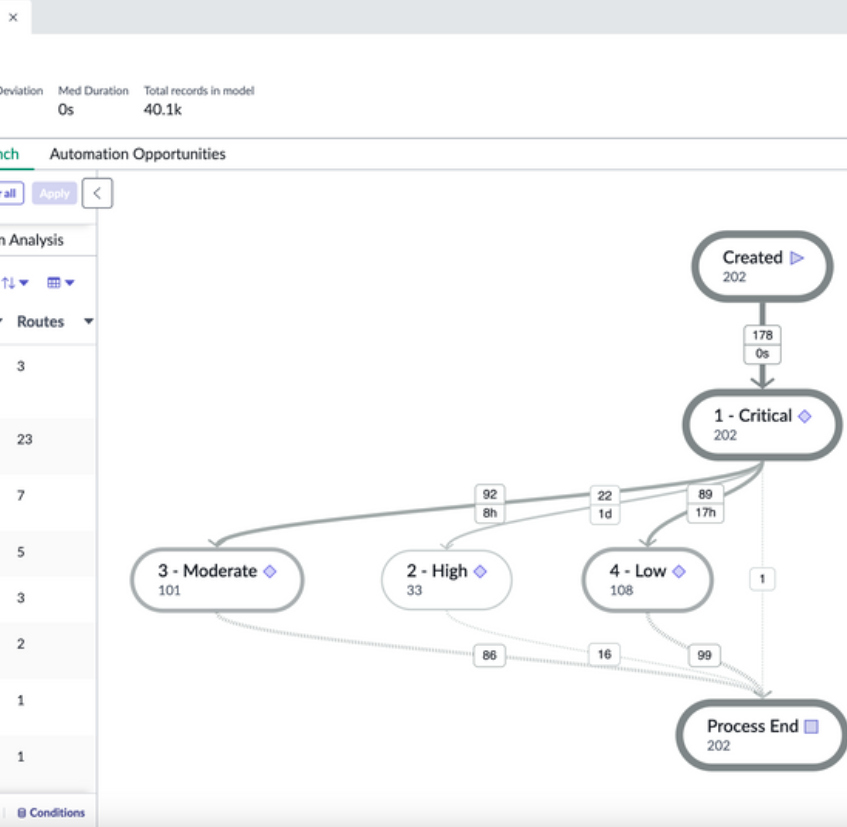

### **2.12 Recategorization Analysis (Análise de recategorização)**
- Avalie como os itens estão sendo categorizados e se há mudanças frequentes.
- Descubra se a categorização inicial pode ser aprimorada.

### **2.13 Impact of a process change (Impacto de mudanças no processo)**
- Compare o desempenho de um processo antes e depois de uma mudança.
- Descubra se a alteração teve um impacto positivo ou negativo na eficiência.

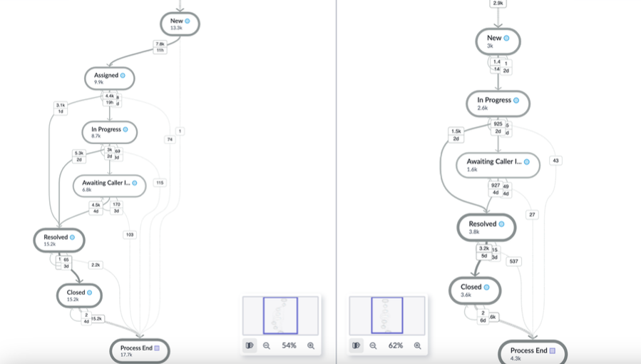

### **2.14 Automation Opportunities (Oportunidades de automação)**
- Identifique processos repetitivos e de baixo valor agregado que podem ser automatizados.
- Avalie quais tarefas têm alto volume e representam um esforço operacional significativo.

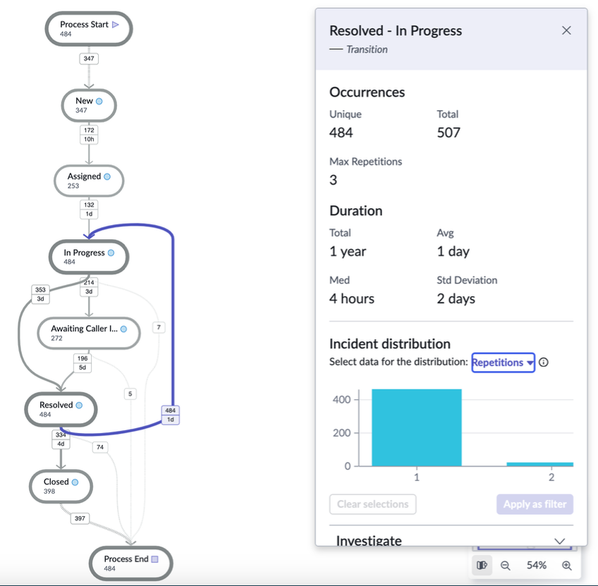

## **3. Descoberta de oportunidades de automação**
A automação pode reduzir o esforço manual, melhorar a eficiência e minimizar erros humanos.

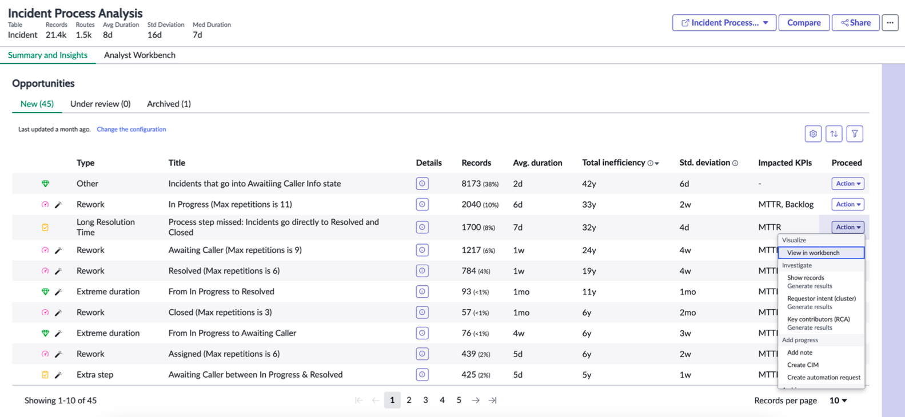

### **3.1 Utilizando o Automation Discovery**
- Utilize o **Automation Discovery** para encontrar processos manuais que podem ser automatizados.
- Identifique tarefas que levam **mais de 2 minutos** (já automatizadas) e **menos de 15 minutos** (baixo esforço para automação).

### **3.2 Virtual Agent e Workflow Automation**
- Analise processos que poderiam ser otimizados com **Virtual Agent** e **Workflow Automation**.
- Descubra oportunidades de **autoatendimento**, permitindo que usuários resolvam problemas sem intervenção manual.

## **4. Validação das mudanças no processo**
Após implementar mudanças ou automações, é essencial validar o impacto e medir os ganhos obtidos.

### **4.1 Comparação antes e depois das mudanças**
- Compare processos **antes e depois** de implementações para medir o impacto.
- Avalie se as mudanças **reduziram o tempo de resolução** e **aumentaram a eficiência operacional**.

## **Conclusão**
A avaliação do **Process Mining**, **Automation Discovery** e **Clustering Recommendations Utility** permite obter insights valiosos sobre a eficiência dos processos. Com essa abordagem, é possível:
- Identificar gargalos e sugerir otimizações.
- Reduzir tempos de espera e aumentar a eficiência operacional.
- Identificar e implementar oportunidades estratégicas de automação.

Além disso, a análise detalhada das oportunidades de automação possibilita uma transformação digital mais eficaz e alinhada com as necessidades do negócio.